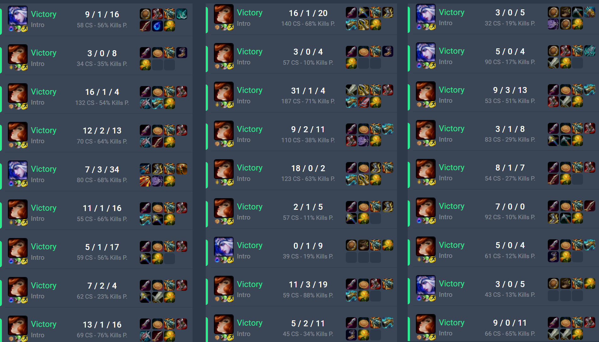

# Riot "AI" - Pixel based League of Legends player

This was one of my earliest projects, created back when I had very little knowledge of Python or programming in general. The code quality clearly reflects that.

I built it to automate the process of creating new League of Legends accounts for ranked play. The game requires players to reach level 30 before joining ranked queues, which normally takes about one to two weeks of playing normal, ARAM, or co-op vs AI matches.

The bot handled this leveling process automatically, letting me generate as many fresh accounts as I wanted. It also became my first way of earning money through programming, as I sold the extra accounts I didn't use.

# Functional stuff that might be useful outside of this project's scope
I used this "bot" on a very poor dual-core machine with integrated graphics so league was running on about 30 FPS so I had not that much of room to do a lot of screenshots per second. The best library you can use for such things is [dxcam](https://pypi.org/project/dxcam/), it utilizes the GPU if you have one. If you don't - [mss](https://pypi.org/project/mss/), it's a pretty fast cpu-based screenshotter on ctypes.

This project uses mss obviously and even that was kinda slow so I wrote a custom method or locating objects on the image [here](scripts/coreAI.py#L11) that uses CV2 to analyze an image, convert colors to a simpler scheme and try to identify an object using confidence bias, returns x and y coordinates of the object on screen.

# The gameplay level
At the time this bot performed quite well at beating easiest "intro" bots, it has health management mechanics, turrets and enemies awareness, custom [shopping code](scripts/shop.py) that crafts and item using recipe, that wasn't a thing on any bot that you met back in those days. Usually bots buy whole components at 1 go, this one crafts a component 1 by 1 on each recall using predefined recipes (also pixel based). Code in here sucks but it worked lol. Here are some games of this guy:

It leveled under 100 accounts in league using couple of bare-metal machines from 2003 and none of those accounts ever got banned for botting.
